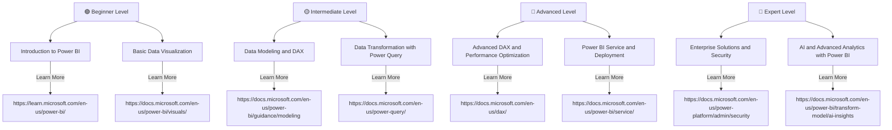

# 🚀 Power BI Learning Roadmap

Welcome to the **Power BI Learning Roadmap**! This guide will help you progress from a beginner to an expert in Power BI, with links to resources, tutorials, and documentation for each stage of your learning journey.

## 📊 Roadmap Overview

The roadmap is divided into 4 levels:

1. **🟢 Beginner Level**  
2. **🟡 Intermediate Level**  
3. **🔵 Advanced Level**  
4. **🔴 Expert Level**  

---

## 🟢 Beginner Level

### 🔹 [Introduction to Power BI](https://learn.microsoft.com/en-us/power-bi/)
- Understanding Business Intelligence
- Overview of Power BI
- Power BI Desktop vs. Power BI Service
- Connecting to data sources

### 🔹 [Basic Data Visualization](https://docs.microsoft.com/en-us/power-bi/visuals/)
- Creating simple charts and graphs
- Formatting visuals
- Using filters and slicers
- Building interactive dashboards

---

## 🟡 Intermediate Level

### 🔹 [Data Modeling and DAX](https://docs.microsoft.com/en-us/power-bi/guidance/modeling)
- Understanding relationships and star schema
- Introduction to DAX (Data Analysis Expressions)
- Creating calculated columns and measures

### 🔹 [Data Transformation with Power Query](https://docs.microsoft.com/en-us/power-query/)
- Cleaning and transforming data
- Using M language for advanced transformations
- Merging and appending queries

---

## 🔵 Advanced Level

### 🔹 [Advanced DAX and Performance Optimization](https://docs.microsoft.com/en-us/dax/)
- Advanced DAX functions and best practices
- Optimizing Power BI reports
- Handling large datasets

### 🔹 [Power BI Service and Deployment](https://docs.microsoft.com/en-us/power-bi/service/)
- Publishing reports to Power BI Service
- Setting up scheduled refreshes
- Managing workspaces and apps

---

## 🔴 Expert Level

### 🔹 [Enterprise Solutions and Security](https://docs.microsoft.com/en-us/power-platform/admin/security)
- Power BI governance and security
- Row-level security (RLS) and object-level security (OLS)
- Power BI integration with Azure and Active Directory

### 🔹 [AI and Advanced Analytics with Power BI](https://docs.microsoft.com/en-us/power-bi/transform-model/ai-insights)
- Using AI insights in Power BI
- Integrating Power BI with Azure Machine Learning
- Predictive analytics and forecasting

---

## 🎓 Certifications and Learning Resources
- [Microsoft Power BI Certification (PL-300)](https://learn.microsoft.com/en-us/certifications/power-bi-data-analyst-associate/)
- [Microsoft Learn modules and documentation](https://learn.microsoft.com/en-us/training/powerplatform/power-bi)
- Community forums and best practices
- GitHub repositories and real-world examples

---

**Happy analyzing! 🚀**

